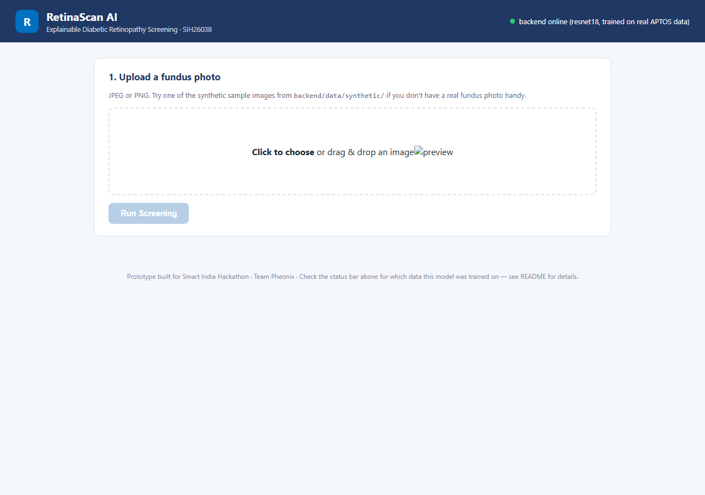
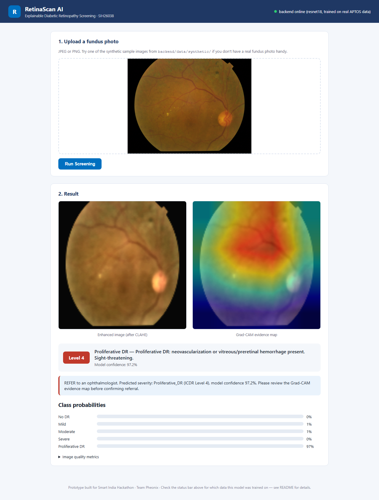
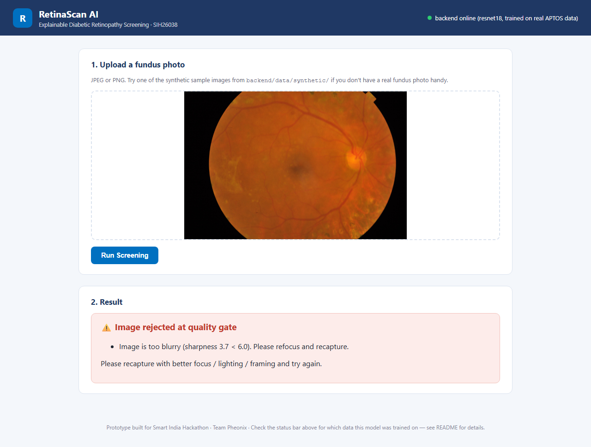

# RetinaScan AI

**Explainable AI for Diabetic Retinopathy Screening in Rural India**
Smart India Hackathon 2026 &middot; Problem Statement **SIH26038** &middot; Organization: MathWorks &middot; Theme: Clean & Green Technology (MedTech/HealthTech) &middot; Team Pheonix

> A screening tool a health worker with zero specialist training can use in
> under 30 seconds — and a heatmap an ophthalmologist can verify in the same
> breath, instead of trusting a black box.

---

## Table of contents

- [The problem](#the-problem)
- [Our idea, and why it's the right one](#our-idea-and-why-its-the-right-one)
- [What makes this different](#what-makes-this-different)
- [Architecture](#architecture)
- [Repository layout](#repository-layout)
- [Quickstart](#quickstart)
- [How it works, stage by stage](#how-it-works-stage-by-stage)
- [The model — honest status](#the-model--honest-status)
- [District-scale throughput simulation](#district-scale-throughput-simulation)
- [Tests](#tests)
- [Screenshots](#screenshots)
- [Architecture Decision Records](#architecture-decision-records)
- [Research this is grounded in](#research-this-is-grounded-in)
- [Roadmap — what we build next](#roadmap--what-we-build-next)

---

## The problem

India has over **77 million diabetic adults** — the second-highest count
globally. **Diabetic Retinopathy (DR)** affects roughly **18%** of them and
is a leading cause of preventable blindness. Early screening can prevent
**up to 90% of DR-related vision loss** — but India has only about **one
ophthalmologist per 100,000 rural people**, making mass manual screening
infeasible.

Existing AI screening tools have three specific failure modes this project
targets directly:
1. They're **black boxes** — a prediction with no clinician-verifiable evidence.
2. They lack **clinical validation rigor** against the actual ICDR severity scale.
3. They **fail silently on bad images** — from portable fundus cameras in real field conditions — instead of flagging the image as ungradeable.

## Our idea, and why it's the right one

**RetinaScan AI** is an end-to-end screening pipeline: a retinal photo goes
in, and out comes a 5-level DR severity grade (ICDR scale), a **Grad-CAM
heatmap** showing exactly which lesion drove that grade, and an
auto-generated referral report — all in a few seconds, on hardware a
Primary Health Centre can actually afford.

We believe this is the strongest answer to PS26038 specifically because it
treats **every stated failure mode of existing tools as a first-class
design requirement**, not an afterthought:

| Existing tools... | RetinaScan AI... |
|---|---|
| are black boxes | ships a Grad-CAM lesion map with *every* prediction |
| assume clean input images | run a dedicated quality-gate stage that rejects bad images *before* they reach the model |
| report a bare accuracy number | report sensitivity/specificity split out for **referable DR (ICDR Level 2+)** specifically, the clinically meaningful threshold |
| stop at "does it work on a benchmark" | include a district-scale throughput simulation, so the answer to "can this actually be deployed" is a number, not a guess |

## What makes this different

- **Explainability is structural, not bolted on.** The API response for
  every accepted image includes the Grad-CAM overlay — there is no code
  path that returns a severity grade without it.
- **The quality gate is a real pipeline stage**, not a TODO. Blurry,
  too-dark, too-bright, or badly-framed images are rejected with a specific,
  actionable reason (`app/pipeline/quality.py`), before a single model
  weight runs.
- **The referral report distinguishes "referable" from "not referable."**
  ICDR Level 2+ (Moderate and above) is flagged for referral — matching
  real clinical triage logic, not just "highest probability class."
- **We modeled deployment, not just accuracy.** `simulation/screening_throughput.py`
  answers "how many screening stations does a district need for 100,000+
  patients/year?" with real queueing-theory math — see [below](#district-scale-throughput-simulation).

## Architecture

```
                         ┌─────────────────────────────────────────────────────────┐
                         │                    FRONTEND (static)                     │
                         │        upload photo → poll /api/health → show result     │
                         └───────────────────────────┬─────────────────────────────┘
                                                       │ multipart/form-data
                                                       ▼
                         ┌─────────────────────────────────────────────────────────┐
                         │                  BACKEND — FastAPI (app/)                │
                         │                                                          │
  image bytes ──────────▶│  Stage 1   Stage 2      Stage 3     Stage 4    Stage 5   │
                         │  Quality → Enhance  →  Classify  →  Grad-CAM →  Report   │
                         │  gate      (CLAHE)     (ResNet18)   (heatmap)  (referral)│
                         │  quality.py preprocess.py model.py  gradcam.py report.py │
                         └─────────────────────────────────────────────────────────┘
                                                       │
                                                       ▼
                         ┌─────────────────────────────────────────────────────────┐
                         │            ml/  — offline training pipeline              │
                         │   generate_synthetic_data.py / download_data.py          │
                         │            → dataset.py → train.py → models/*.pt         │
                         └─────────────────────────────────────────────────────────┘

              simulation/screening_throughput.py — district rollout sizing (standalone)
```

Full request flow for one image:

```
Upload → decode → assess_quality()
                       │
              ┌────────┴────────┐
        rejected              gradable
              │                    │
     return reasons        enhance_pipeline() (CLAHE + denoise + resize)
     (no model run)                │
                            to_model_tensor()
                                    │
                              model(tensor) → logits → softmax → severity + confidence
                                    │
                          GradCAM(model).generate() → heatmap → overlay_heatmap()
                                    │
                            build_report() → referral recommendation
                                    │
                          JSON response (+ base64 PNGs) → frontend renders result
```

## Repository layout

```
RetinaScanAI/
├── backend/
│   ├── app/
│   │   ├── main.py                 # FastAPI app + CORS
│   │   ├── config.py                # env-driven settings
│   │   ├── schemas.py               # Pydantic request/response models
│   │   ├── pipeline/
│   │   │   ├── quality.py           # Stage 1: blur/brightness/FOV gate
│   │   │   ├── preprocess.py        # Stage 2: CLAHE, denoise, tensor prep
│   │   │   ├── model.py             # Stage 3: ResNet18 / SimpleCNN
│   │   │   ├── gradcam.py           # Stage 4: Grad-CAM from scratch
│   │   │   └── report.py            # Stage 5: referral report text
│   │   └── routers/predict.py       # POST /api/predict, GET /api/health
│   ├── ml/
│   │   ├── generate_synthetic_data.py
│   │   ├── download_data.py         # real Kaggle datasets (APTOS/IDRiD/...)
│   │   ├── prepare_aptos.py          # Kaggle train.csv -> labels.csv manifest
│   │   ├── dataset.py                # PyTorch Dataset (+ resize cache)
│   │   └── train.py                  # training + evaluation loop
│   ├── models/                       # trained checkpoints + training logs
│   ├── data/synthetic/               # generated demo dataset (committed)
│   ├── data/raw/                     # real Kaggle data (git-ignored, ~8GB)
│   ├── tests/                        # pytest suite (29 tests)
│   └── requirements.txt
├── frontend/                         # plain HTML/CSS/JS, no build step
│   ├── index.html / styles.css / app.js
├── simulation/
│   ├── screening_throughput.py       # district-scale Erlang-C model
│   └── test_screening_throughput.py
├── docs/
│   ├── adr/                          # 6 Architecture Decision Records
│   └── screenshots/
└── scripts/                          # one-command dev-run helpers
```

## Quickstart

Requires Python 3.10+. No GPU, no MATLAB, no Kaggle account needed for the demo.

```bash
cd RetinaScanAI/backend
pip install -r requirements.txt

# 1. Generate the synthetic demo dataset (400 images, a few seconds)
python ml/generate_synthetic_data.py --out data/synthetic --n-per-class 80

# 2. Train the demo model (~5-10 min on CPU)
python ml/train.py --data-dir data/synthetic --epochs 8 --arch resnet18

# 3. Run the tests
pytest

# 4. Start the API
uvicorn app.main:app --reload --port 8000
# -> interactive docs at http://localhost:8000/docs
```

In a second terminal:

```bash
cd RetinaScanAI/frontend
python -m http.server 5500
# -> open http://localhost:5500
```

Or use the one-command scripts in `scripts/` (`run_backend.ps1` / `.sh` and
`run_frontend.ps1` / `.sh`), which auto-generate data + train if no
checkpoint exists yet.

### Training on real data (APTOS 2019)

This repo has actually been trained on the real dataset, not just the
synthetic one — see [results below](#the-model--honest-status).

```bash
# 1. Get the data: either via Kaggle CLI (ml/download_data.py --dataset aptos,
#    needs your own kaggle.json), or download the competition zip manually
#    from kaggle.com/c/aptos2019-blindness-detection and unzip it.
#    Either way, place it at backend/data/raw/aptos2019/ — it must contain
#    train.csv and train_images/ (the standard Kaggle layout).

# 2. Convert Kaggle's train.csv into the labels.csv manifest ml/train.py
#    expects — this does NOT copy any image bytes, just writes one small CSV:
python ml/prepare_aptos.py --aptos-dir data/raw/aptos2019

# 3. Train. First epoch is slow (each image's resized version gets cached
#    to data/raw/aptos2019/.cache128/ on first read); every epoch after
#    that is fast, since it reads the small cached version instead of
#    re-decoding the full 3216x2136 original.
python ml/train.py --data-dir data/raw/aptos2019 --epochs 6 --arch resnet18 \
    --batch-size 32 --out models/retina_cnn_aptos.pt --log models/training_log_aptos.json

# 4. Point the API at the real-data checkpoint instead of the synthetic demo one:
export RETINASCAN_MODEL_PATH=models/retina_cnn_aptos.pt   # or set it in .env / your shell
uvicorn app.main:app --reload --port 8000
```

`backend/data/raw/` (the real, full-resolution Kaggle images) is
git-ignored — it's ~8GB and Kaggle's competition rules don't permit
redistributing it, so it never leaves your machine.

## How it works, stage by stage

1. **Quality Assessment** (`app/pipeline/quality.py`) — Laplacian-variance
   blur score, mean-brightness illumination check, Otsu-threshold field-of-view
   coverage. Any failure returns a specific, human-readable reason
   ("Image is too blurry... please refocus and recapture") instead of a
   generic rejection.
2. **Enhancement** (`app/pipeline/preprocess.py`) — CLAHE on the LAB
   lightness channel (standard retinal-imaging contrast trick), edge-preserving
   bilateral-filter denoise, resize + ImageNet normalization.
3. **Classification** (`app/pipeline/model.py`) — ImageNet-pretrained
   ResNet18, fine-tuned end-to-end, 5-way softmax over the ICDR scale
   (No DR / Mild / Moderate / Severe / Proliferative DR).
4. **Explainability** (`app/pipeline/gradcam.py`) — Grad-CAM heatmap over
   the predicted class, generated from the same forward pass, overlaid on
   the enhanced image with OpenCV's JET colormap.
5. **Referral report** (`app/pipeline/report.py`) — ICDR Level 2+ is flagged
   `is_referable=true` with a "REFER to an ophthalmologist" recommendation;
   below that, "routine annual re-screening."

## The model — honest status

This repo ships **two checkpoints**, and it matters which one you're
looking at:

| Checkpoint | Trained on | Purpose |
|---|---|---|
| `retina_cnn_demo.pt` (default) | Synthetic images (`ml/generate_synthetic_data.py`) | Zero-setup demo — proves the pipeline works with no external accounts |
| `retina_cnn_aptos.pt` | **Real APTOS 2019 data** (3,662 Kaggle competition images) | Real, if still preliminary, clinical-relevance evidence |

<!-- TRAINING_RESULTS_START -->
### Real data: APTOS 2019 (3,662 images)

6 epochs, ResNet18, class-weighted loss (real DR data is heavily
imbalanced — see `ml/train.py`), 80/20 split (2,931 train / 731 val),
resize-cached after the first pass, CPU-only, **27.5 minutes**.

Best checkpoint auto-selected at **epoch 6**:

| Metric (validation, n=731, real patients) | Value | PS26038 target |
|---|---|---|
| Overall 5-class accuracy | 74.7% | — |
| **Referable DR (ICDR 2+) sensitivity** | **86.5%** | >90% |
| **Referable DR (ICDR 2+) specificity** | **95.2%** | >85% ✅ |

Per-class breakdown:

| Class | Precision | Recall (Sensitivity) | Specificity | Support |
|---|---|---|---|---|
| No DR | 0.975 | 0.956 | 0.976 | 361 |
| Mild | 0.530 | 0.716 | 0.928 | 74 |
| Moderate | 0.746 | 0.503 | 0.936 | 199 |
| Severe | 0.265 | 0.579 | 0.912 | 38 |
| Proliferative DR | 0.433 | 0.441 | 0.949 | 59 |

**This is an honest, real result, not a validated clinical one, and it's
not yet at the PS26038 target.** Specificity clears the bar (95.2% > 85%);
sensitivity doesn't yet (86.5% vs. >90%) — meaning the model still misses
some referable cases it should catch. Precision on Severe (0.265) is
particularly weak — it's the rarest class (38 of 731 val samples) and
class-weighting alone only goes so far with this little data per class.
This is a real, credible starting point after 27 minutes of CPU training on
one competition dataset — not a finished clinical product. The roadmap
below (more epochs, higher resolution, lesion segmentation, an ensemble
across APTOS+IDRiD+Messidor-2) is what closes that remaining gap, not a
rerun of the same 6 epochs.

Full 6-epoch history in `backend/models/training_log_aptos.json`.

### Synthetic data (fallback / zero-setup demo)

8 epochs, ResNet18, 400 synthetic images, 80/20 split, CPU-only, 157.6s.
Best checkpoint at epoch 3: **93.8% referable-DR sensitivity, 93.8%
specificity** on 80 synthetic validation images (`retina_cnn_demo.pt`,
`training_log.json`).

**⚠️ Do not read those synthetic numbers as "better than the real ones
above."** They're higher because the synthetic task is easier, not because
that checkpoint knows more — synthetic images encode severity as a
directly-correlated, clean visual signal (lesion *count*); real fundus
photos don't. The synthetic checkpoint exists so the app runs with zero
setup; the APTOS checkpoint above is the one with real evidentiary value,
partial as it is.
<!-- TRAINING_RESULTS_END -->

### A real bug real data caught: the quality gate was miscalibrated

Worth calling out specifically, because it's the clearest example of why
testing on real data (not just synthetic) matters: the quality-gate
thresholds in `app/pipeline/quality.py` were originally tuned by eye
against the synthetic dataset — whose hard, procedurally-drawn edges give
unrealistically high blur scores. Tested against real APTOS photos, the
original blur threshold (60.0) **rejected 98% of real fundus images**
outright, including correctly-focused ones — because real photography is
naturally far smoother than a synthetic vector drawing, even in focus.

Recalibrated using percentile statistics from a random 150-image sample
of real APTOS photos (median blur score 14.3 vs. the old 60.0 threshold),
the gate now passes **89.3%** of real images and rejects the genuine
outliers — a sane, defensible rate. See the comment block in
`quality.py` for the full before/after numbers. This kind of
synthetic-to-real domain gap is exactly why [ADR 0005](docs/adr/0005-synthetic-data-for-poc.md)
insists synthetic-only results should never be read as real-world
evidence — and exactly why it was worth downloading the real dataset
and finding out.

## District-scale throughput simulation

`simulation/screening_throughput.py` models district-level rollout as a
multi-server queue (Erlang-C) — the Python equivalent of the Simulink model
called for in PS26038 (see [ADR 0004](docs/adr/0004-throughput-simulation.md)).

```bash
python simulation/screening_throughput.py \
  --patients-per-year 100000 --seconds-per-screening 45 --target-wait-minutes 10
```

<!-- SIMULATION_RESULTS_START -->
```
Target: 100,000 patients/year, <= 10.0 min average wait

{
  "stations": 1,
  "arrival_rate_per_hour": 41.67,
  "service_rate_per_hour": 80.0,
  "offered_load_erlangs": 0.52,
  "utilization": 0.521,
  "prob_wait": 0.521,
  "mean_wait_minutes": 0.82,
  "mean_patients_in_queue": 0.57,
  "stable": true
}

=> Recommendation: deploy 1 screening stations (tablet + portable fundus
camera + this AI pipeline each) per district to hit the target.
```
<!-- SIMULATION_RESULTS_END -->

The finding is genuinely useful, not just a demo number: because each
screening takes ~45 seconds end-to-end, a *single* station comfortably
clears 100,000 patients/year within an 8-hour/300-day operating calendar.
The real deployment bottleneck for a district isn't AI throughput — it's
**geographic coverage** (getting a station within reach of every village),
which reframes the rollout plan from "how many GPUs do we need" to "how
many physical stations, where."

## Tests

33 tests across 9 files — quality gate, preprocessing, the dataset/cache
layer, model, Grad-CAM, referral logic, the full API, and the throughput
simulator.

```bash
cd backend && pytest        # 29 pass (1 is model-dependent, skips until a checkpoint exists)
cd simulation && pytest     # 4 pass
```

<!-- TEST_RESULTS_START -->
**Actual latest run — 33/33 passing:**

```
backend$ pytest
tests/test_api.py::test_root_endpoint PASSED
tests/test_api.py::test_health_endpoint_reachable PASSED
tests/test_api.py::test_predict_rejects_bad_upload PASSED
tests/test_api.py::test_predict_quality_gate_rejects_blurry_image PASSED
tests/test_api.py::test_predict_full_pipeline_on_synthetic_sample PASSED
tests/test_dataset.py::test_dataset_length_matches_labels_csv PASSED
tests/test_dataset.py::test_dataset_item_shape_and_label_range PASSED
tests/test_dataset.py::test_augmentation_does_not_crash_and_preserves_shape PASSED
tests/test_dataset.py::test_resize_cache_is_created_and_reused PASSED
tests/test_dataset.py::test_use_cache_false_does_not_create_cache_dir PASSED
tests/test_gradcam.py::test_gradcam_produces_normalized_heatmap PASSED
tests/test_gradcam.py::test_overlay_heatmap_shape_matches_base_image PASSED
tests/test_gradcam.py::test_lesion_evidence_summary_keys PASSED
tests/test_model.py::test_simple_cnn_forward_shape PASSED
tests/test_model.py::test_build_model_resnet18_has_correct_head PASSED
tests/test_model.py::test_build_model_simple_cnn_fallback PASSED
tests/test_model.py::test_predict_returns_valid_class_and_confidence PASSED
tests/test_model.py::test_class_names_match_icdr_scale PASSED
tests/test_preprocess.py::test_clahe_enhance_preserves_shape_and_dtype PASSED
tests/test_preprocess.py::test_enhance_pipeline_resizes_to_target PASSED
tests/test_preprocess.py::test_to_model_tensor_shape_and_normalization PASSED
tests/test_quality.py::test_good_image_is_gradable PASSED
tests/test_quality.py::test_blurry_image_is_rejected PASSED
tests/test_quality.py::test_dark_image_is_rejected PASSED
tests/test_quality.py::test_quality_report_has_expected_fields PASSED
tests/test_report.py::test_no_dr_is_not_referable PASSED
tests/test_report.py::test_moderate_dr_is_referable PASSED
tests/test_report.py::test_proliferative_dr_is_referable PASSED
tests/test_report.py::test_confidence_appears_in_recommendation_text PASSED
============================= 29 passed in 12.58s =============================

simulation$ pytest
test_screening_throughput.py::test_single_station_utilization_matches_manual_calc PASSED
test_screening_throughput.py::test_more_stations_reduces_wait_time PASSED
test_screening_throughput.py::test_unstable_system_flagged_when_understaffed PASSED
test_screening_throughput.py::test_find_min_stations_meets_target_wait PASSED
============================== 4 passed in 0.02s ===============================
```
<!-- TEST_RESULTS_END -->

## Screenshots

<!-- SCREENSHOTS_START -->
Captured from a real run of the app (backend on :8000, frontend on :5500)
using **real APTOS fundus photos** and the **real-data-trained checkpoint**
(`retina_cnn_aptos.pt`), driven headlessly with Playwright — not mockups,
not synthetic images.

**1. Upload screen** — the status bar confirms which checkpoint is live
("trained on real APTOS data"), so it's never ambiguous which model you're
looking at:



**2. A real Proliferative-DR photo, correctly classified** (97.2%
confidence) — Grad-CAM heatmap (right) highlighting the region around the
visible hemorrhage, referral recommendation triggered, full
class-probability breakdown:



**3. Quality gate on a real photo** — this specific real APTOS image gets
rejected for low sharpness under the recalibrated threshold; a genuine
edge case caught by the gate rather than a staged failure:


<!-- SCREENSHOTS_END -->

## Architecture Decision Records

| ADR | Decision |
|---|---|
| [0001](docs/adr/0001-python-over-matlab.md) | Python (PyTorch/FastAPI) prototype instead of MATLAB/Simulink |
| [0002](docs/adr/0002-model-architecture.md) | ResNet18 transfer learning, SimpleCNN offline fallback |
| [0003](docs/adr/0003-explainability-gradcam.md) | Hand-implemented Grad-CAM, no third-party XAI library |
| [0004](docs/adr/0004-throughput-simulation.md) | Erlang-C queueing model instead of a Simulink discrete-event sim |
| [0005](docs/adr/0005-synthetic-data-for-poc.md) | Synthetic training data for the POC; real-data path documented separately |
| [0006](docs/adr/0006-fastapi-and-vanilla-js.md) | FastAPI backend; dependency-free vanilla-JS frontend |

## Research this is grounded in

| Research / Paper | Gap identified | How RetinaScan AI bridges it |
|---|---|---|
| Gulshan et al., 2016, *JAMA* — Deep learning for detection of diabetic retinopathy | Black-box predictions, no clinician-interpretable evidence | Grad-CAM lesion-level heatmap on every prediction |
| Ting et al., 2017, *JAMA* — DL system for DR across multiethnic populations | Validated on clinical-grade cameras, not portable/field devices | Dedicated image-quality-assessment stage before grading |
| Gulshan et al., 2019, *JAMA Ophthalmology* — ML DR screening validation in India (Aravind Eye Hospital) | No system-level plan for scaling screening across a district/state health system | District-scale throughput simulation (`simulation/`) |
| APTOS 2019 Kaggle Challenge — top DR-grading solutions | Optimized purely for classification accuracy, not clinician trust/adoption | Human-in-the-loop referral workflow, doctor-verifiable in under 30 seconds |

Datasets referenced (see `ml/download_data.py`):
- **APTOS 2019 Blindness Detection** — kaggle.com/c/aptos2019-blindness-detection
- **IDRiD** (Indian Diabetic Retinopathy Image Dataset) — ieee-dataport.org
- **DRIVE** (Digital Retinal Images for Vessel Extraction) — drive.grand-challenge.org
- **Messidor-2** — adcis.net/en/third-party/messidor2

## Roadmap — what we build next

Once this prototype is accepted / validated, in priority order:

1. **Close the sensitivity gap.** Real APTOS training now exists (86.5%
   referable-DR sensitivity / 95.2% specificity, see above) — specificity
   already clears the PS26038 target, sensitivity doesn't yet. Next: more
   epochs with a learning-rate schedule, higher input resolution (128→224,
   see the note in `preprocess.py`), and adding IDRiD + Messidor-2 as
   additional training data (`ml/download_data.py` has both) rather than
   APTOS alone.
2. **Lesion-level segmentation**, not just classification — microaneurysm /
   hemorrhage / exudate segmentation masks (the PS explicitly calls for
   sub-pixel microaneurysm detection), layered *underneath* the Grad-CAM
   heatmap so a clinician sees both the coarse attention region and the
   precise lesion boundaries.
3. **MATLAB/Simulink port** of the throughput simulator (ADR 0004), for
   teams that need the literal toolchain named in the PS, or a hybrid where
   MATLAB Coder exports the trained model as ONNX for this same Python
   serving layer.
4. **Mobile / offline capture app** — pair with a low-cost portable fundus
   camera, with on-device quality gating before upload (catch a bad photo
   at the point of capture, not after a round trip to the server).
5. **Clinician review loop** — persist referrals, let an ophthalmologist
   confirm/override with one tap, and feed that feedback back into
   retraining (active learning) rather than treating the model as static.
6. **District pilot** — take the throughput simulation's station-count
   recommendation and actually deploy it at one Primary Health Centre,
   closing the loop between the simulated plan and a real rollout.

---

*Built for Smart India Hackathon 2026, Problem Statement SIH26038, by Team Pheonix.*
